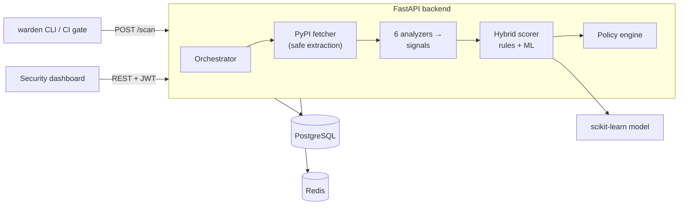

<div align="center">

#  Warden — Software Supply-Chain Firewall

**Stop malicious open-source packages *before* they enter your codebase.**

[](https://pypi.org/project/warden-supply-chain-firewall/)
[](https://pypi.org/project/warden-supply-chain-firewall/)
[](https://github.com/rakshit-737/warden-supply-chain-firewall/actions/workflows/ci.yml)
[](LICENSE)

A behavioural firewall for Python dependencies: it fetches and statically analyses a
package's real code and metadata, fuses rule-based and machine-learning signals into a
0–100 risk verdict, and enforces organisational policy (allow / warn / block) through a
REST API, a CI/CLI gate, and a security-team dashboard.

[Architecture](docs/ARCHITECTURE.md) ·
[Threat Model](docs/THREAT_MODEL.md) ·
[API](docs/API.md) ·
[ML Model](docs/ML_MODEL.md) ·
[Ideation](docs/IDEATION.md)

</div>

---

## Why this exists

Modern applications are mostly third-party code, and a single `pip install` executes with
the developer's or CI runner's full privilege. Attackers weaponise this through malicious
publishes (install-time code that exfiltrates secrets), **typosquats** (`reqeusts` for
`requests`), and **dependency confusion**.

A traditional vulnerability scanner **cannot catch any of this** — there is no CVE for a
package nobody has reported yet. Warden is a *behavioural* control: it decides whether a
package is trustworthy from **how it is built and what it does**, not from a vulnerability
database. That distinction is the heart of the project.

## What it does



For a `(name, version)` it will, in a few hundred milliseconds:

1. **Fetch** the real source distribution from PyPI and extract it under strict
   anti-zip-bomb / anti-path-traversal guards — **without ever executing package code**.
2. **Analyse** it with six independent analyzers producing explainable *signals*:
   metadata/provenance, AST-based behavioural analysis, install-time execution,
   typosquatting, obfuscation, and known-IOC matching.
3. **Score** the signals with a *tiered* rule engine **and** a calibrated ML model
   (RandomForest + IsolationForest), fused conservatively.
4. **Decide** allow / warn / block against a tunable organisational policy, and record an
   auditable verdict with the exact signals that drove it.

## Highlights for reviewers

- **Behavioural, not signature-based** — catches never-before-seen malicious packages.
- **Explainable end-to-end** — every verdict lists the signals and the policy rules that
  fired; the dashboard shows both the rule score and the ML score.
- **ML where it earns its place** — non-linear risk probability + unsupervised novelty,
  with graceful degradation to rules-only if the model is absent. (See
  [`ML_MODEL.md`](docs/ML_MODEL.md).)
- **Hostile-input hardened** — the analyzer is designed around the fact that its input is
  attacker-authored: safe extraction, size/time/count caps, and **no code execution**.
  (See [`THREAT_MODEL.md`](docs/THREAT_MODEL.md).)
- **Production-shaped** — JWT auth with refresh rotation, argon2id hashing, RBAC,
  structured logging with request IDs, rate limiting, an append-only audit trail, Alembic
  migrations, a full test suite, containerisation with a read-only non-root runtime, and
  CI.

## Tech stack

| Layer | Choices |
|-------|---------|
| Backend | Python 3.12, FastAPI, SQLAlchemy 2, Alembic, pydantic v2 |
| Analysis / ML | Python `ast`, scikit-learn (RandomForest + IsolationForest), joblib |
| Data | PostgreSQL, Redis (cache + rate limiter) |
| Frontend | React 18, TypeScript, Vite, Tailwind CSS, Recharts |
| Delivery | Docker + docker-compose, GitHub Actions CI, `warden` CLI |

## Quick start (Docker — full stack)

```bash
git clone <your-fork-url> warden && cd warden
export SECRET_KEY=$(python -c "import secrets;print(secrets.token_urlsafe(48))")
docker compose up --build
```

- Dashboard: <http://localhost:8080>
- API + Swagger docs: <http://localhost:8000/docs>
- Sign in with the bootstrap admin (`admin@warden.io` / `ChangeMe_Warden!2026` — override
  via `FIRST_ADMIN_EMAIL` / `FIRST_ADMIN_PASSWORD`).

## Quick start (backend only, no services)

The backend runs on SQLite with an in-process cache — no Postgres/Redis needed — which is
also exactly how the test-suite runs.

```bash
cd backend
pip install -r requirements-dev.txt
python -m ml.train            # generate dataset + train the model (a few seconds)
uvicorn app.main:app --reload # http://localhost:8000/docs
pytest -q                     # 40 tests, fully offline
```

Front end:

```bash
cd frontend && npm install && npm run dev   # http://localhost:5173
```

## Using the CLI as a CI gate

```bash
# One package
python -m cli.warden_cli scan requests==2.32.3 --api http://localhost:8000 --token "$WARDEN_TOKEN"

# Gate a whole requirements file — exits non-zero if anything is BLOCKED
python -m cli.warden_cli gate -r requirements.txt --api "$WARDEN_API" --token "$WARDEN_TOKEN" --fail-on block
```

Example output:

```
ALLOW  risk= 25 requests==2.32.3   [SINGLE_MAINTAINER; NETWORK_EGRESS]
BLOCK  risk=100 reqeusts==1.0.0    [TYPOSQUAT; INSTALL_HOOK_EXEC; IOC_MATCH]

Gate FAILED (fail-on=block): reqeusts==1.0.0
```

## How detection tuning works (the interesting part)

Legitimate libraries *do* call the network, shell out, and read environment variables — so
naïvely flagging those produces false positives. Warden separates signals into two tiers:

- **Primary indicators** (install-time network/eval, IOC match, typosquat, obfuscated
  loader, sensitive-credential access) — any *one* can drive a package to high/critical.
- **Supporting capabilities** (generic network, subprocess, dynamic exec, provenance) —
  these accumulate only up to a **capped ceiling**, so a complex-but-benign package like
  `numpy` lands at *medium*, never *critical*.

Measured behaviour of the shipped model + rules against real PyPI packages:

| Package | Risk | Verdict | Package | Risk | Verdict |
|---------|-----:|---------|---------|-----:|---------|
| `requests` | 25 | low | typosquat + install-exfil (synthetic) | 100 | **block** |
| `flask` | 31 | low | obfuscated base64 loader (synthetic) | 100 | **block** |
| `numpy` | 40 | medium | credential stealer (synthetic) | 100 | **block** |

## Repository layout

```
warden/
├── backend/
│   ├── app/
│   │   ├── analysis/         # fetcher, analyzers, scoring, ML serving
│   │   │   └── analyzers/    # metadata, static_code, install_script, typosquat, obfuscation, ioc
│   │   ├── api/              # routers, deps (RBAC), middleware
│   │   ├── core/             # config, security, logging, errors, cache/rate-limit
│   │   ├── db/               # models, session, portable types, seed
│   │   ├── policy/           # policy engine
│   │   └── main.py           # app factory
│   ├── ml/                   # dataset generator + training pipeline
│   ├── cli/                  # `warden` CI gate
│   ├── alembic/              # migrations
│   └── tests/                # 40 tests incl. adversarial-extraction security tests
├── frontend/                 # React + TS + Tailwind dashboard
├── docs/                     # ideation, architecture, threat model, data model, ML, API
├── docker-compose.yml
└── .github/workflows/ci.yml
```

## Documentation

- [`IDEATION.md`](docs/IDEATION.md) — the 20 candidate ideas, scoring, and why this won.
- [`ARCHITECTURE.md`](docs/ARCHITECTURE.md) — components, request lifecycle, trade-offs.
- [`THREAT_MODEL.md`](docs/THREAT_MODEL.md) — STRIDE + adversarial-input handling.
- [`DATA_MODEL.md`](docs/DATA_MODEL.md) — ER diagram and schema rationale.
- [`ML_MODEL.md`](docs/ML_MODEL.md) — features, training, evaluation, honest limitations.
- [`API.md`](docs/API.md) — endpoint reference (live OpenAPI at `/docs`).

## Roadmap

npm ecosystem analyzers · dynamic sandbox detonation (gVisor/Firecracker) · full
transitive-tree scanning · PEP 503 inline-blocking registry proxy · analyst-override
retraining loop. See [`ARCHITECTURE.md`](docs/ARCHITECTURE.md#9-roadmap-documented-extensions).

## License

MIT — see [`LICENSE`](LICENSE).

> **Note on the ML dataset.** Real labelled malicious-package corpora aren't redistributable
> in a public repo, so Warden ships a *seeded synthetic generator* grounded in documented
> attack patterns. The deliverable is the **pipeline** (feature engineering → training →
> calibration → serving → graceful degradation); swapping in a real labelled corpus is a
> one-file change. This is stated openly in [`ML_MODEL.md`](docs/ML_MODEL.md).
