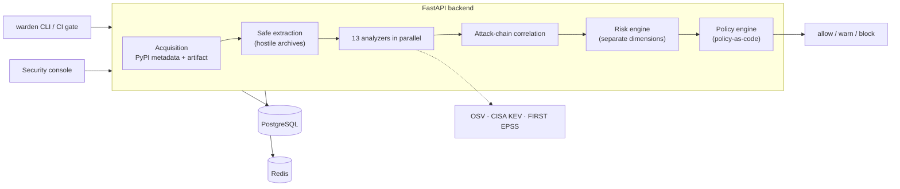

<div align="center">

# Warden, A Software Supply-Chain Security Platform

**Decide whether a dependency is safe to install — from what its code does, where it came from, and what is known about it.**

[](https://pypi.org/project/warden-supply-chain-firewall/)
[](https://pypi.org/project/warden-supply-chain-firewall/)
[](https://github.com/rakshit-737/warden-supply-chain-security/actions/workflows/ci.yml)
[](LICENSE)

[Architecture](docs/ARCHITECTURE.md) ·
[Threat Model](docs/THREAT_MODEL.md) ·
[Data Model](docs/DATA_MODEL.md) ·
[ML Model](docs/ML_MODEL.md) ·
[API](docs/API.md)

</div>

---

## Why this exists

A single `pip install` runs third-party code with the developer's or the CI runner's privileges.
Attackers exploit that with malicious publishes, typosquats, dependency confusion, and account
takeovers of packages that were fine yesterday.

A vulnerability scanner cannot see any of this: there is no CVE for a package nobody has reported
yet. Warden asks a different question — *what does this package do, and who really published it?* —
and keeps vulnerability intelligence as a **separate** dimension, because the two risks are not the
same thing:

|                          | No known CVE | Known CVE |
|--------------------------|--------------|-----------|
| **Behaviourally benign** | ordinary dependency | patch it |
| **Behaviourally malicious** | what Warden is for | both problems at once |

## What a scan does



For a `(name, version)` Warden fetches the real distribution, extracts it under hostile-archive
guards, and analyses it **without ever executing package code**.

## Detection layers

| Analyzer | What it looks for |
|---|---|
| `metadata` | release age, maintainer count, missing source repository, release floods, yanked releases |
| `typosquat` | edit distance, Jaro-Winkler, keyboard adjacency, homoglyphs and Unicode confusables, combosquats — weighted by how popular the imitated package is (top 5000 real PyPI names) |
| `static_code` | AST behaviour: network egress, process and shell execution, dynamic evaluation, credential environment and file access, with install-time / import-time / runtime context |
| `install_script` | the highest-value vector: active code in `setup.py`, `cmdclass` hooks, in-tree PEP 517 build backends, executable `.pth` startup hooks, `sitecustomize`, console scripts that shadow real commands |
| `obfuscation` | high-entropy blobs, decode-then-execute chains, layered encodings, hex and compressed payloads, runtime string reconstruction — decoded under strict bounds, never executed |
| `ioc` | indicators from a bundled snapshot (URLs, addresses, wallet strings, code fingerprints) |
| `inventory` | prebuilt binaries in a source distribution, nested archives, suspicious file types, wheel contents that diverge from the sdist |
| `secrets` | hard-coded credentials, reported as a redacted preview plus a keyed fingerprint — never the value; optional gitleaks adapter |
| `dependency_confusion` | internal namespaces that also exist publicly, checked against a **local** index snapshot so private names are never sent to the registry; implausible version jumps on brand-new projects |
| `provenance` | PEP 740 publish attestations via PyPI's Integrity API, publisher/repository mismatch, releases after long dormancy, maintainer changes between releases |
| `yara_scan` | versioned YARA rules for loaders, credential theft, droppers, persistence, exfiltration, reverse shells, miners, packed binaries (optional dependency) |
| `semgrep_scan` | packaged Semgrep rules plus your own local rule sets (optional tool) |
| `vulnerability` | OSV advisories, CISA KEV, FIRST EPSS, optional NVD — cached and rate-limited |

Optional tools that are not installed report themselves unavailable and the scan says so; they
never silently return "nothing found".

### Findings, not just a number

Every analyzer emits the same `Finding`: severity **and** a separate confidence, the exact file and
line where known, CWE and MITRE ATT&CK mappings, remediation, and provenance of the observation.
Evidence is sanitised on construction — control characters escaped, sizes bounded, secrets redacted
— because it comes from attacker-controlled input.

The correlation engine then combines findings into named attack chains (credential theft followed by
exfiltration, install-time droppers, obfuscated loaders, persistence implants, typosquat and
dependency-confusion payloads, takeover behaviour changes) with an ATT&CK tactic per step. Chains
built only from capability-grade observations require the steps to sit in the same file plus
install-time or evasion evidence, so an SDK that reads credentials in one module and makes HTTPS
calls in another is not reported as an attack chain.

### Risk is several numbers

`risk_score` stays a 0–100 value for compatibility, but it is derived, not invented:

- **behavioural** — the transparent weighted rule score (strong indicators at full weight, ordinary
  capabilities capped so a large legitimate package cannot accumulate its way to critical)
- **vulnerability** — worst CVSS, KEV listing, EPSS probability; `null`, never `0`, when
  intelligence is unavailable
- **provenance**, **reputation**, **dependency**, **integrity**, **secret**, **anomaly**,
  **exploitability**, and **blast radius** when project context is supplied

A deterministic critical finding with high confidence floors the score at 80. The ML model may
sharpen a verdict the rules already support, but **when the rules see little it can add only a
bounded margin** — a guardrail added after measuring the model against real packages (see below).

### Policy as code

```yaml
apiVersion: warden.dev/v1
kind: Policy
metadata: { name: production, environment: production }
spec:
  thresholds: { warn: 40, block: 70 }
  deny:
    categories: [malicious_behavior, credential_access, attack_chain, dependency_confusion]
    capabilities: [install_hook_exec, ioc]
    vulnerabilities: { known_exploited: true, min_severity: critical }
    min_confidence: 0.7
  require: { hash_verified: true }
```

Rules fire only at or above the configured confidence, so capability-grade observations cannot block
a build on their own. Known-malware matches, critical attack chains and hash mismatches are
**non-overridable**: no allowlist or exception removes them. Exceptions are time-boxed, scoped to a
package (optionally a version range and specific finding codes), require a justification, and are
approved by someone other than the requester — enforced server-side. Unknown vulnerability
intelligence warns rather than silently allowing.

## Measured on real packages

Warden's own analyzers were run against established PyPI projects, and the results are part of the
project rather than a claim: `backend/ml/collect_real_features.py` records the feature vectors into
`backend/ml/data/real_benign_features.csv`, which training mixes in as measured negatives.

That measurement caught a real defect. A model trained only on synthetic samples separated the
synthetic classes almost perfectly and still scored ordinary libraries as malicious — the synthetic
"benign" distribution never contained a package that ships TLS keys in its test suite, so any
detected secret looked malicious. The fix was threefold: classify secrets found in test fixtures by
path, add measured real-world negatives to training, and stop the model from creating a critical
verdict the deterministic layer does not support.

## What is implemented today

- **Package scanning** end to end: acquisition, safe extraction, 13 analyzers, correlation, risk,
  policy, persistence, events and audit.
- **REST API**: authentication with refresh-token rotation, scans, policies and policy validation,
  exceptions workflow, events, audit with chain verification, users, system info, ML model and drift,
  health, Prometheus metrics.
- **Security console** (React + TypeScript): dashboard, scan history and detail (risk breakdown,
  attack chains, findings with locations and mappings, vulnerabilities, provenance, analyzer runs),
  new scan, policies, events, audit with integrity verification, exceptions workflow, users, system.
- **SBOM engine** (CycloneDX 1.6 and SPDX 2.3) and a **dependency graph engine** with blast radius
  and dominator metrics — both usable as libraries today.
- **Vulnerability intelligence**: OSV, CISA KEV, FIRST EPSS, optional NVD, with a spec-exact CVSS
  v3.x calculator.
- **RBAC** with five roles, a **hash-chained audit log** with a verification endpoint, security
  events, Prometheus metrics, and structured logging that redacts secrets.
- **Warden's own supply chain**: every GitHub Action pinned by commit SHA, least-privilege tokens,
  `pip-audit` able to fail the build, PostgreSQL migration round-trip, image scanning and SBOM,
  CodeQL, gitleaks and Trivy, signed build provenance on release.

## Not implemented yet (deliberately listed)

- Project-level scanning API and the dependency-graph UI (the SBOM and graph engines exist; the HTTP
  routes and pages are placeholders).
- Release-to-release behavioural diffing, container image scanning, the continuous
  monitoring worker, and the opt-in dynamic sandbox.
- CLI `diff`, `image scan` and `report` commands.
- npm and other ecosystems.

## Quick start

**Full stack (Docker):**

```bash
cp .env.example .env     # fill in the required secrets; the stack refuses to start without them
docker compose up --build
```

Dashboard on <http://127.0.0.1:8080>. Add `--profile observability` for Prometheus and the Warden
SOC Grafana dashboard.

**Backend only (SQLite, no services):**

```bash
cd backend
pip install -r requirements-dev.txt
python -m ml.train --n 4000      # trains the model artifact
uvicorn app.main:app --reload    # http://localhost:8000/docs
pytest -q                        # offline: any test that touches the network fails
```

**Frontend:**

```bash
cd frontend && npm install && npm run dev
```

## CLI and CI gate

Package verdicts come from the API (`WARDEN_API` / `WARDEN_TOKEN` may replace the flags):

```bash
python -m cli.warden_cli scan requests==2.32.3 --api "$WARDEN_API" --token "$WARDEN_TOKEN"
python -m cli.warden_cli gate -r requirements.txt --api "$WARDEN_API" --token "$WARDEN_TOKEN" --fail-on block
```

Local commands (run from `backend/`) use the engines in-process, need no server or token, and never
execute project code:

```bash
python -m cli.warden_cli project scan . --fail-on high            # manifest hygiene + dependency confusion
python -m cli.warden_cli project scan . --format sarif -o warden.sarif
python -m cli.warden_cli sbom generate . --format cyclonedx -o bom.json   # honours SOURCE_DATE_EPOCH
python -m cli.warden_cli policy validate ../policies/production.yaml
```

The SARIF output is validated against the official SARIF 2.1.0 schema in the test suite and can be
uploaded with `github/codeql-action/upload-sarif`; results point at the manifest file and, when
known, the line that declared the dependency. Findings stay stable across runs through a
fingerprint derived from the finding id.

In a workflow, the repository doubles as a GitHub Action (`action.yml`). It uploads the SARIF report
before enforcing the gate, so a failing build still shows its alerts; the job needs
`security-events: write`:

```yaml
- uses: rakshit-737/warden-supply-chain-security@<commit-sha>
  with:
    path: .
    fail-on: high
```

Exit codes: `0` allowed or passed, `2` something was blocked or failed the check, `3` usage or
transport error.

## Security posture of Warden itself

Warden processes attacker-authored archives, so its own hardening is part of the product: package
code is never executed, archives are read under path, size, count, depth and time limits that also
cover skipped members and pax headers (decompression bombs), artifact digests are verified, outbound
HTTP is restricted to allow-listed hosts on every redirect hop with size caps and rate limits, and
secrets are redacted before anything is logged, stored or returned. The containers run as non-root
on digest-pinned bases with a read-only root filesystem.

See [`SECURITY.md`](SECURITY.md) and [`docs/THREAT_MODEL.md`](docs/THREAT_MODEL.md).

## Honest limitations

- Static analysis is evadable by sufficiently novel obfuscation. Warden reduces risk; it does not
  eliminate it, and it is not a substitute for reviewing what you depend on.
- The ML model is trained on synthetic samples plus a small measured set of real packages. Its
  reported metrics are **synthetic hold-out** numbers, not real-world performance, and the pipeline
  deliberately limits what the model alone can decide.
- Vulnerability intelligence is only as current as its sources, and "unknown" is reported as unknown.
- Provenance verification stops at binding an attestation to the artifact digest; cryptographic
  signature verification is not implemented, so Warden never reports a release as fully verified.
- The bundled indicator and popularity lists are point-in-time snapshots.
- CI workflows and container images have not been executed in this environment; they are checked
  statically.

## License

MIT — see [`LICENSE`](LICENSE).
