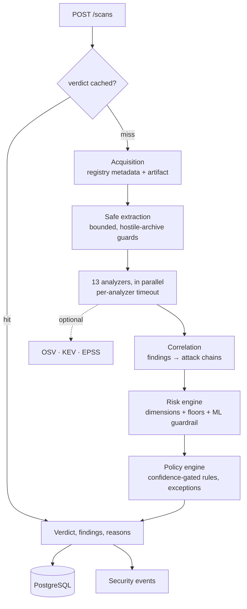

# Architecture

## 1. The problem

Installing a dependency runs someone else's code with your privileges. The attacks that matter are
malicious publishes, typosquats, dependency confusion, and takeovers of packages that were fine
last week. A vulnerability scanner cannot see any of them, because there is no CVE for a package
nobody has reported yet.

Warden answers a different question — *what does this package do, and who published it?* — and keeps
vulnerability intelligence as a separate dimension rather than folding both into one number.

## 2. Goals and non-goals

**Goals.** Decide allow / warn / block for a `(ecosystem, name, version)` in seconds. Explain every
verdict down to the file and line. Be enforceable where it matters (developer machine, CI). Let
security teams express policy as code. Fail closed: an incomplete analysis is never a clean result.

**Non-goals.** Not a CVE scanner (it consumes advisories, it does not replace a scanner). Not a
sandbox detonation platform: nothing analysed is ever executed. Not a registry mirror.

## 3. Pipeline

### 3.1 Acquisition (`app/analysis/acquisition`, `fetcher.py`)

Resolves the release against the registry, selects an artifact (source distribution preferred, wheel
as fallback), downloads it under a size cap, and verifies the digest the registry published against
the bytes actually received. A requested version that does not exist is an error: scanning "latest"
instead would hand back a verdict for a different artifact than the one that will be installed.

All outbound HTTP goes through one hardened client: HTTPS only, host allowlist checked on **every
redirect hop**, response size caps, bounded retries with backoff, client-side rate limiting, and
query strings stripped from anything logged.

### 3.2 Safe extraction (`app/analysis/extraction`)

The input is hostile by definition. Format is detected from magic bytes, not the filename. Every
member is checked for path traversal, absolute paths, drive letters, control characters, depth and
length. Symlinks, hardlinks and devices are never followed. Limits cover member count, retained
bytes, per-file size, retained binary budget, wall-clock, and — importantly — the *declared* size of
members that are skipped, because skipping a member still decompresses it. That last bound is what
stops a pax-header or skipped-member decompression bomb.

What survives is a bounded inventory: decoded text files, retained binaries for signature scanning,
and a per-member record (size, sha256, magic, executable-ness) even for members whose bytes were not
kept.

### 3.3 Analyzers (`app/analysis/analyzers`)

Fourteen analyzers run concurrently, each with its own timeout, each returning `Finding` objects:
metadata, typosquat, static code, install script, install vectors (`.pth` start-up hooks, in-tree
build backends, console scripts shadowing common commands), obfuscation, IOC, inventory, secrets,
dependency confusion, provenance, YARA, Semgrep, vulnerability. They never execute package code and never
perform I/O beyond their declared needs; the two intelligence-backed ones are skipped in offline
scans. An analyzer that crashes or times out produces `ANALYZER_ERROR`, which raises risk rather than
silently shrinking the evidence, and the result is not cached.

A finding carries severity **and** confidence separately, the file and line where known, CWE and
ATT&CK mappings, remediation, and the provenance of the observation. Evidence is sanitised on
construction: bounded, control characters escaped, secrets redacted.

### 3.4 Correlation (`app/analysis/correlation`)

Individual capabilities are weak evidence; sequences are strong. The correlation engine matches
findings against chain templates — credential access then exfiltration, install-time droppers,
obfuscated loaders, persistence implants, typosquat and dependency-confusion payloads, takeover
behaviour changes — and emits a chain with an ATT&CK tactic per step.

Chains built only from capability-grade findings additionally require co-location in one file plus
install-time or evasion evidence. Without that rule, every SDK that reads credentials in one module
and makes HTTPS calls in another would look like an exfiltration chain.

### 3.5 Risk engine (`app/analysis/risk.py`, `scoring.py`)

Separate dimensions, each with its own confidence and contributing findings: behavioural,
vulnerability, provenance, reputation, dependency, integrity, secret, anomaly, exploitability, and
blast radius when project context is supplied.

- The behavioural (rule) score weights strong indicators fully and caps ordinary capabilities, so a
  large legitimate package cannot accumulate its way to critical.
- Vulnerability risk is computed from CVSS, KEV listing and EPSS, and is `null` — not `0` — when
  intelligence is unavailable.
- A deterministic critical finding with high confidence floors the final score at 80.
- The model can sharpen a verdict but not invent one: below a rule score of 35 it may add at most 25
  points. This guardrail exists because measurement against real packages showed a synthetic-trained
  model scoring ordinary libraries as malicious (see `docs/ML_MODEL.md`).

### 3.6 Policy engine (`app/policy`)

Policies are documents (thresholds, deny and warn rules by finding code, category, capability and
vulnerability, provenance requirements, allowlists, exceptions) validated strictly and identified by
a hash recorded on every verdict. Rules fire only at or above a configured confidence. Known-malware
matches, critical attack chains and hash mismatches are non-overridable. Exceptions are scoped,
time-boxed, justified, and approved by someone other than the requester. Unknown vulnerability
intelligence warns instead of silently allowing.

## 4. Platform

- **API** (`app/api`): FastAPI, permission-checked routes, request-id validation, streamed body-size
  limits, proxy-aware rate limiting, strict security headers, sanitised errors.
- **Data** (`app/db`): PostgreSQL in production, SQLite for tests, portable column types, Alembic
  migrations verified against the models and round-tripped on PostgreSQL in CI.
- **Audit**: every security-relevant action is appended to a sha256 hash chain with a verification
  endpoint. On PostgreSQL a trigger rejects updates and deletes on the audit table.
- **Events**: security events are rows first (the durable record) and a Redis stream second (a
  best-effort notification).
- **Observability**: Prometheus metrics with bounded labels, structured JSON logs that redact
  secrets, optional OpenTelemetry spans.
- **Console** (`frontend/`): React and TypeScript. Dashboard, scans and scan detail, new scan,
  packages, projects (manifest scans, components, dependency graph, SBOM export), release diffs,
  containers, monitoring, policies, events, audit with chain verification, exceptions workflow,
  users, system.
- **Monitoring worker** (`app/workers/monitor.py`): claims due watched packages with a lease, checks
  them for new releases, stores release diffs and publishes events; it touches a heartbeat file the
  Compose healthcheck reads.

## 5. Supporting engines

**SBOM** (`app/sbom`) parses requirements files, `pyproject.toml`, `poetry.lock` and `Pipfile.lock`
with exact line provenance and emits CycloneDX 1.6 or SPDX 2.3, validated against the official
schemas in tests. **Graph** (`app/graph`) turns an inventory into a dependency graph with depth,
blast radius, dominators and centrality. Both back the project API and the `warden project scan` /
`sbom generate` commands.

**Release diffs** (`app/analysis/diff.py`) compare two analysed releases: risk and dimensions,
capabilities, findings by code and file, the file inventory and declared maintainers.

**Containers** (`app/containers`) lint Dockerfiles and Compose files, analyse `docker save` / OCI
image archives in memory with the same safe-extraction guards as packages (layer whiteouts
applied), and optionally run Trivy for known vulnerabilities, reporting "not assessed" when it is
missing.

**Reporting** (`app/reporting`) renders findings as SARIF 2.1.0 (validated against the official
schema) and saved results as escaped Markdown or self-contained HTML.

**Benchmark** (`backend/benchmark`) runs a small synthetic, inert corpus through the real pipeline;
see [BENCHMARK.md](BENCHMARK.md).

## 6. Trade-offs

| Decision | Why | Cost |
|---|---|---|
| Static analysis only | Deterministic, fast, and safe: the classic payload runs at install time, and "just run it to see" is what the attacker wants | Misses runtime-only behaviour; a sandbox is designed ([SANDBOX.md](SANDBOX.md)) but not built |
| Separate severity and confidence | Lets policy demand strong evidence before blocking, instead of one blurred number | More to reason about per finding |
| Separate behavioural and vulnerability risk | "Malicious" and "vulnerable" are different questions with different responses | Two numbers to explain |
| Bounded ML influence | Measured false positives on real packages | The model contributes less than its synthetic metrics suggest |
| Fail closed on incomplete analysis | A partial scan must not read as clean | Large packages on slow links can surface as elevated risk |
| Optional tools degrade gracefully | Warden must work without YARA, Semgrep or gitleaks installed | Coverage varies by deployment, so scans report which layers ran |

## 7. What is not built yet

The opt-in dynamic sandbox (design only, see [SANDBOX.md](SANDBOX.md)); transitive dependencies for
project scans beyond what lock files record (a PyPI-backed resolver exists in `app/sbom/resolver.py`
but is not wired into the API or CLI); ecosystems other than PyPI; and a Marketplace release of the
GitHub Action (it is usable from the repository today).
