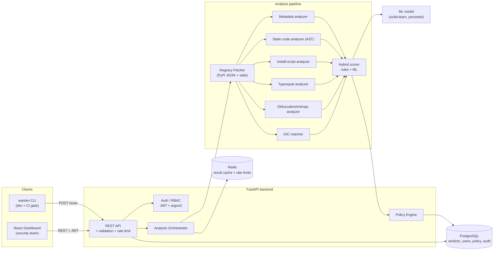

# Architecture

## 1. Problem statement

Modern applications are mostly third-party code. A single `pip install` or `npm install`
can pull hundreds of transitive packages, each of which executes with the full privilege
of the developer or the CI runner. Attackers exploit this in three recurring ways:

1. **Malicious publish** — a brand-new package, or a compromised maintainer account, ships
   code that runs at *install time* (e.g. `setup.py`) to exfiltrate secrets or open a
   reverse shell.
2. **Typosquatting** — `reqeusts`, `python3-dateutil`, `crypt` masquerade as popular
   packages and rely on a developer typo.
3. **Dependency confusion** — an internal package name is registered on the public index
   with a higher version so the resolver prefers the attacker's copy.

Traditional **vulnerability scanners cannot see any of this**: there is no CVE for a
package nobody has reported yet. Warden is a *behavioural* control — it decides whether a
package is trustworthy from how it is built and what it does, not from a vulnerability
database.

## 2. Design goals & non-goals

**Goals**

- Decide `ALLOW / WARN / BLOCK` for a `(ecosystem, name, version)` in seconds.
- Be explainable: every verdict lists the exact signals that drove it.
- Be enforceable at the two points that matter: the developer's machine (CLI) and CI.
- Be policy-driven so security teams tune strictness without code changes.
- Fail *safe and predictable*: analyzer errors degrade to a conservative signal, never a
  silent `ALLOW`.

**Non-goals**

- Not a SCA/CVE scanner (complementary, not a replacement).
- Not a sandbox detonation platform — v1 is static analysis only; dynamic sandboxing is a
  documented future extension (see §9).
- Not a package registry mirror.

## 3. System overview

## 4. Component responsibilities

### 4.1 Registry fetcher (`app/analysis/fetcher.py`)
Resolves a package against the public PyPI JSON API, selects the release artifact
(preferring the sdist for source visibility), downloads it into an isolated temp dir with
strict size/time limits, and extracts it safely (path-traversal-guarded `tar`/`zip`
extraction). All egress is confined to this component so the rest of the pipeline operates
on local files only.

### 4.2 Analyzers (`app/analysis/analyzers/`)
Each analyzer implements a common `Analyzer` protocol and returns a list of typed
`Signal` objects (`code`, `severity`, `weight`, `message`, `evidence`). Analyzers are pure
and independent, which makes them individually unit-testable and safe to run concurrently.

| Analyzer | What it detects |
|----------|-----------------|
| `metadata` | New-package risk, single-maintainer risk, release-cadence anomalies, missing repo/license, name/homepage mismatch |
| `static_code` | Dangerous imports (`os`, `subprocess`, `socket`, `ctypes`), `eval`/`exec`/`compile`, dynamic import, network egress, env-var/credential harvesting, filesystem writes to sensitive paths |
| `install_script` | Code execution inside `setup.py`/`setup.cfg`/PEP 517 build hooks (the classic install-time RCE vector) |
| `typosquat` | Small edit-distance to a bundled list of the most-downloaded packages, plus homoglyph/keyboard-adjacency checks |
| `obfuscation` | High-entropy string blobs, `base64`/`marshal`/`zlib` decode-then-exec chains, long single-line payloads |
| `ioc` | Exact/substring match against a bundled indicator set (URLs, IPs, wallet addresses, known-bad hashes) |

### 4.3 Hybrid scorer (`app/analysis/scoring.py`)
Two independent scores are computed and fused:

- **Rule score** — a transparent weighted sum of signal weights, capped and normalised to
  0–100. Fully explainable and deterministic.
- **ML score** — a `RandomForestClassifier` produces a calibrated malicious-probability
  from the numeric feature vector; an `IsolationForest` adds an unsupervised
  novelty/anomaly component for packages that don't look like anything in the training
  distribution.

The final risk is `max(rule_score, ml_score)` by default (a conservative "either signal
can raise an alarm" fusion), configurable per deployment. Keeping the two scores separate
means the dashboard can show *both*, and an operator who distrusts the model can fall back
to rules-only via policy.

### 4.4 Policy engine (`app/policy/engine.py`)
Evaluates the verdict against the active `Policy`: score thresholds for `WARN`/`BLOCK`,
hard capability blocks (e.g. "block anything with install-time network egress"),
allowlist/denylist, and minimum package age. Produces the final `decision` plus the
matched rules, so the CLI can print *why* a build was blocked.

### 4.5 API layer (`app/api/`)
FastAPI with pydantic v2 schemas. Concerns are separated into routers (`auth`, `scans`,
`policies`, `audit`, `health`). Cross-cutting middleware handles request-ID injection,
structured access logging, security headers, and a Redis-backed sliding-window rate
limiter. See `API.md`.

### 4.6 Frontend (`frontend/`)
React + TypeScript + Vite + Tailwind. Talks only to the REST API, stores the access token
in memory (refresh token in an httpOnly cookie), and renders the risk posture dashboard,
scan detail (signal breakdown + feature contributions), manual scan, policy editor, and
audit log.

## 5. Request lifecycle (a scan)

1. CLI/UI sends `POST /api/v1/scans` `{ecosystem, name, version}` with a bearer token.
2. Auth middleware validates the JWT and loads the caller + role.
3. The orchestrator checks Redis for a cached verdict keyed by
   `sha256(ecosystem:name:version:analyzer_version)`. Hit → return immediately.
4. Miss → fetcher downloads & extracts the artifact under resource limits.
5. Analyzers run concurrently and emit signals.
6. Signals are reduced to a numeric feature vector; the hybrid scorer produces
   `rule_score`, `ml_score`, `risk_score`, `severity`.
7. The policy engine maps the verdict to a `decision`.
8. The verdict + signals are persisted, cached, and an audit event is written.
9. The response returns the decision, scores, and the full signal list.

## 6. Technology choices & trade-offs

| Choice | Why | Trade-off considered |
|--------|-----|----------------------|
| **Python / FastAPI** | The analysis and ML core is Python-native (AST, scikit-learn); FastAPI gives async I/O, pydantic validation, and free OpenAPI. | Go is faster for a data-plane agent, but would split the ML core across a process boundary for little gain at this scope. |
| **PostgreSQL** | Relational verdict/audit data with strong constraints and JSONB for flexible signal payloads. | A document store was rejected — the audit and RBAC data is relational and benefits from foreign keys. |
| **Redis** | Verdict cache (re-scans are common in CI) and the rate-limiter backend. | In-memory caching would not survive horizontal scale-out. |
| **scikit-learn** | Right-sized, reproducible, ships a small persisted model; explainable feature importances. | Deep learning is unjustified — the feature space is small and tabular. |
| **React + Vite + Tailwind** | Fast modern DX, strong typing, responsive without a heavy component framework. | — |
| **`max(rule, ml)` fusion** | Conservative: neither subsystem can silently suppress the other's alarm. | Can over-warn; mitigated by tunable policy thresholds. |
| **Static-only analysis in v1** | Deterministic, fast, safe (never executes untrusted code), fully containerisable. | Misses runtime-only behaviour; dynamic sandbox is a documented v2. |

## 7. Security architecture (summary)

Full detail in `THREAT_MODEL.md`. Highlights:

- **We analyse hostile input by design.** Untrusted archives are extracted with
  path-traversal guards, size caps, and file-count caps; package code is **never
  executed** — only parsed. The analyzer process is the intended container isolation
  boundary.
- **AuthN**: argon2id password hashing, short-lived JWT access tokens, rotating refresh
  tokens in httpOnly cookies.
- **AuthZ**: role-based (`admin` / `analyst` / `viewer`) dependency-injected guards on
  every mutating route.
- **Input validation**: pydantic v2 everywhere; package names constrained to the
  ecosystem's legal grammar before they ever reach the fetcher.
- **Rate limiting** per identity and per IP.
- **Auditing**: every auth event, scan, and policy change is written to an append-only
  audit table.
- **Secure defaults**: security headers, CORS allowlist, no secrets in code, `.env`-driven
  config with a fail-closed settings validator.

## 8. Scalability & operations

- The API is **stateless**; scale horizontally behind a load balancer. Session state lives
  in Postgres/Redis only.
- Analysis is CPU-bound and independent per package — the orchestrator is written so the
  synchronous path can be moved behind a task queue (Celery/RQ) without touching the API
  contract. The `POST /scans` handler already returns a persisted verdict id, so an async
  `202 + poll` mode is a drop-in.
- Verdict caching makes the common CI case (re-scanning an unchanged lockfile) effectively
  free.
- Health/readiness endpoints and structured JSON logs make it container-orchestrator
  friendly.

## 9. Roadmap (documented extensions)

1. **npm ecosystem** analyzers (the analyzer protocol is ecosystem-agnostic by design).
2. **Dynamic sandbox detonation** in a gVisor/Firecracker microVM for install-time
   behavioural capture.
3. **Full transitive dependency-tree scanning** with a single aggregate verdict.
4. **Registry proxy mode** — a PEP 503 simple-index proxy that blocks inline.
5. **Model feedback loop** — analyst overrides feed a retraining dataset.
