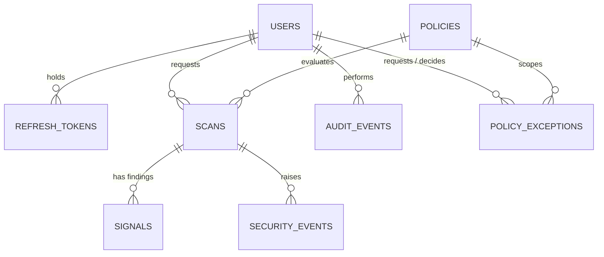

# Data Model

PostgreSQL in production, SQLite for the test suite. Portable column types (`GUID`, `PortableJSON`)
map to native `UUID`/`JSONB` on PostgreSQL. The schema is defined in `backend/app/db/models.py` and
created by Alembic migrations `0001_initial` → `0002_warden_x` → `0003_scan_environment`. A test
upgrades a fresh database to head and compares it with the models; CI also runs
upgrade → downgrade → upgrade against a real PostgreSQL 16.

## Entities in use today

| Table | Purpose | Notes |
|---|---|---|
| `users` | Accounts | Role stored as a string: `admin`, `security_analyst`, `developer`, `auditor`, `read_only`. The v1 names `analyst` and `viewer` were migrated. |
| `refresh_tokens` | Opaque refresh tokens | Only a sha256 of the token is stored. A revoked token presented again revokes the user's whole family. |
| `policies` | Enforcement policies | Legacy columns (thresholds, capability lists, allow/deny lists) plus an optional policy-as-code `document`, an `environment`, and a `version`. One active policy per environment. |
| `policy_exceptions` | Time-boxed waivers | Package (normalised), optional version range, optional code/category scope, environment, justification, requester, approver, status, expiry. Expiry is evaluated when read; the approver must differ from the requester. |
| `scans` | One verdict per package version, analyzer version and environment | Scores (final, rule, ML, malicious, vulnerability), severity, decision, the risk breakdown, attack chains, analyzer runs, package intelligence, provenance, vulnerabilities, intelligence status, model version, policy reasons, feature vector. |
| `signals` | Findings of a scan | v1 columns plus finding id, confidence, category, title, analyzer and version, capability, location, CWE, ATT&CK, remediation, references, provenance, related findings. Evidence is already sanitised and redacted when stored. |
| `audit_events` | Append-only audit trail | `seq`, `prev_hash` and `event_hash` form a sha256 chain over a canonical encoding of each event. On PostgreSQL a trigger rejects `UPDATE` and `DELETE`; appends take an advisory lock so the chain cannot fork. |
| `security_events` | Operational security events | Type, severity, title, package and version, optional scan and project, sanitised details, acknowledgement. The row is the durable record; a Redis stream carries a best-effort copy. |

## Projects, diffs, containers and monitoring

| Table | Written by | Notes |
|---|---|---|
| `projects` | `POST /projects` | Unique name. |
| `project_scans` | `POST /projects/{id}/scans` | Manifests (file, type, sha256), counts, decision, risk, findings summary, graph and the CycloneDX document. The submitted manifest text itself is not stored. |
| `project_components` | project scans | One row per component, with declaration positions and the id, risk and decision of the newest stored verdict for the same name, version and environment. |
| `dependency_edges` | project scans | Parent and child `bom_ref` with the specifier. |
| `release_diffs` | `POST /diffs`, the monitoring worker | One row per package, version pair and analyzer version; summary and the findings new in the newer release. |
| `container_scans` | `POST /containers/scans` | Label, config digest, `completed` / `incomplete`, tool status, summary, findings and the CycloneDX component list. The image archive is not stored. |
| `monitored_packages` | `/monitoring` routes, the worker | Baseline (`approved_version`), last seen version and risk, snapshot, schedule, consecutive failures. A partial unique index covers rows without a project. |
| `vulnerability_records` | `GET /vulnerabilities/lookup` | Advisory cache keyed by OSV id with KEV and EPSS enrichment. |
| `scan_jobs` | — | Reserved for queued work; nothing writes to it yet. |

## Design notes

- **Findings are denormalised onto the scan** as JSON as well as stored in `signals`: the JSON
  keeps a scan's explanation self-contained and immutable, while `signals` supports aggregation
  (the dashboard's most frequent findings).
- **Idempotent verdicts.** A rescan of the same package version under the same analyzer version and
  environment updates that row instead of piling up duplicates; changing the analyzer version keeps
  history separate.
- **Nothing sensitive at rest.** Passwords are argon2id hashes, refresh tokens are hashes, and
  secrets found inside packages are stored only as redacted previews and keyed fingerprints.
- **Indexes** cover the lookups the API makes: package name and creation time on scans, decision
  and risk, finding code and category, event type, severity and time, audit actor and action,
  exception package and expiry.
