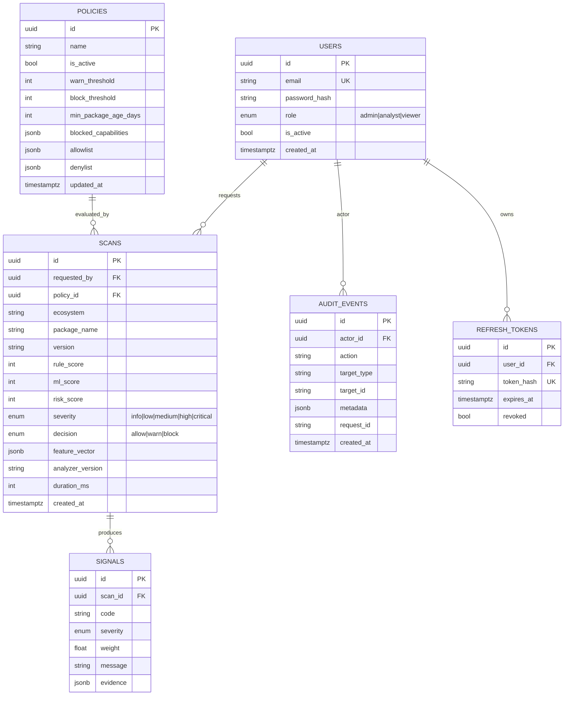

# Data Model

PostgreSQL. Managed via SQLAlchemy 2.0 (typed, declarative) and Alembic migrations.
JSONB is used where a column stores a variable-shape but query-secondary payload (signal
evidence, feature vectors, policy rules).

## Notes & rationale

- **UUID primary keys** avoid enumerable ids in the API surface.
- **`SCANS.feature_vector` (JSONB)** stores the exact numeric features fed to the model,
  which makes verdicts reproducible and lets the dashboard show feature contributions.
- **`SIGNALS`** is a child table rather than a JSON blob on the scan so signals are
  independently queryable (e.g. "how many packages this month tripped `INSTALL_NETWORK`").
- **`REFRESH_TOKENS.token_hash`** stores only a hash — a database leak does not yield
  usable refresh tokens.
- **`AUDIT_EVENTS`** is append-only by convention (no update/delete routes) and carries
  the `request_id` so a verdict can be traced to the exact HTTP request.
- **`analyzer_version`** is part of the cache key and stored on every scan so historical
  verdicts remain interpretable after analyzer logic changes.
