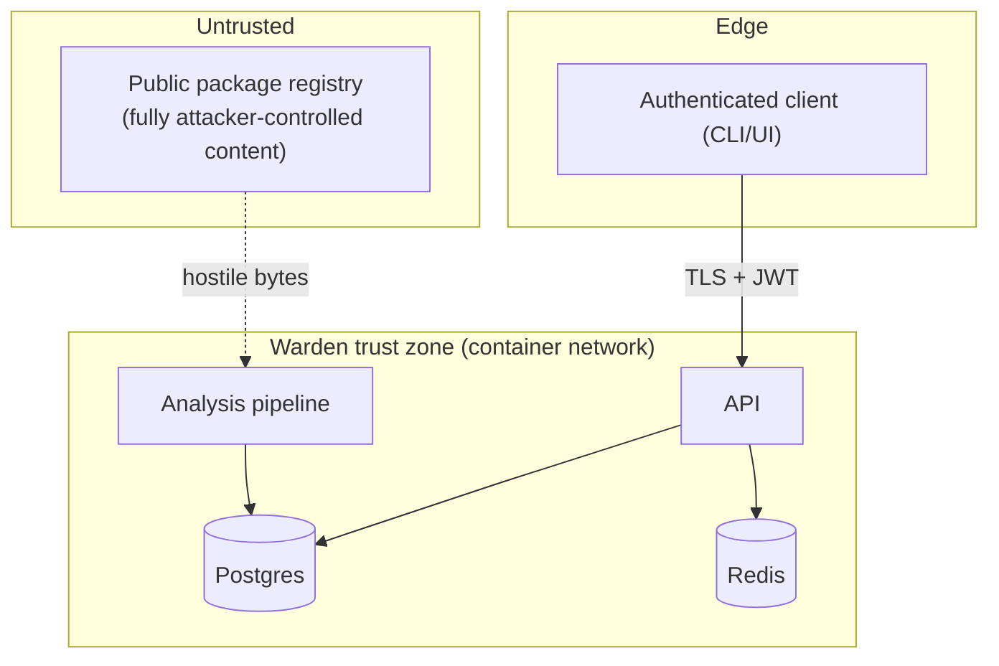

# Threat Model

Warden is unusual: **its input is deliberately hostile**. It downloads and inspects code
that may have been published specifically to attack whatever processes it. The threat
model therefore covers both (a) the application as an ordinary web service and (b) the
analysis pipeline as a consumer of adversarial artifacts.

## 1. Assets

| Asset | Why it matters |
|-------|----------------|
| Verdict integrity | A tampered verdict could wave malware through or block good builds |
| User credentials & tokens | Access to the security console |
| Policy configuration | Weakening policy silently disables the control |
| Audit log | Tamper-evidence for investigations |
| The analysis host itself | Extracting/parsing hostile archives is a potential RCE surface |

## 2. Trust boundaries

The critical boundary is **Untrusted → Analysis pipeline**. Everything crossing it is
treated as malicious until proven otherwise.

## 3. STRIDE analysis

| Threat | Vector | Mitigation |
|--------|--------|------------|
| **Spoofing** | Forged tokens, credential stuffing | argon2id hashing, signed short-lived JWTs, refresh rotation, per-identity rate limiting, generic auth errors |
| **Tampering** | Altering verdicts or policy via API | RBAC guards on all mutations, pydantic validation, DB constraints, append-only audit trail |
| **Repudiation** | "I didn't change that policy" | Every mutation writes an actor-attributed audit event with request id |
| **Information disclosure** | Verbose errors, stack traces, secret leakage | Central error handler returns sanitised problem+JSON; secrets only via env; security headers; no secrets in logs |
| **Denial of service** | Huge/zip-bomb packages, scan floods | Download size cap, extraction file-count & total-size caps, per-file read cap, wall-clock timeout, rate limiting, result caching |
| **Elevation of privilege** | Malicious package achieving code exec on the analyzer | **Code is never executed** — only fetched and statically parsed; path-traversal-guarded extraction; runs as non-root in a read-only-rootfs container as the isolation boundary |

## 4. Adversarial-input specifics (the hard part)

Because the pipeline ingests attacker-authored archives:

- **Path traversal / Zip-Slip** — every archive member is normalised and rejected if it
  escapes the extraction root or is an absolute path or a symlink. Verified by
  `tests/test_fetcher_security.py`.
- **Zip bombs / tar bombs** — hard caps on decompressed total size, member count, and
  per-member size; extraction aborts and yields a conservative `EXTRACTION_ABORTED`
  signal (which itself raises risk) rather than crashing.
- **Parser DoS** — AST parsing is wrapped in size limits and time budgets; a file that
  cannot be parsed becomes an `UNPARSEABLE` signal, never an unhandled exception.
- **No execution, ever** — Warden statically parses `setup.py`; it does *not* run it. This
  is the single most important design decision: the classic malicious-package payload is
  install-time code, and the naïve way to "see what it does" (run it) is exactly what the
  attacker wants.
- **SSRF containment** — network egress exists only in the fetcher and only to resolved,
  scheme/host-validated registry artifact URLs; the analyzers have no network access.

## 5. Fail-safe posture

The control is designed to **fail closed on ambiguity**: fetch failures, extraction
aborts, and parser failures all *raise* the risk signal rather than defaulting to a clean
`ALLOW`. A misconfigured or degraded Warden should block builds and page a human, not
quietly approve unknown packages.

## 6. Residual risks (honestly stated)

- Static analysis is evadable by sufficiently novel obfuscation; the ML anomaly component
  mitigates but does not eliminate this. Dynamic detonation (roadmap) closes much of the
  gap.
- The bundled typosquat/IOC/popular-package lists are snapshots; in production they would
  be fed from a maintained threat-intel source.
- Warden reduces, but does not remove, the need for review of high-value dependencies.
