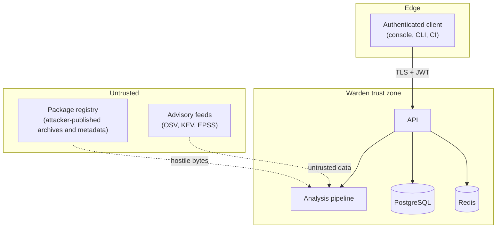

# Threat Model

Warden is unusual: **its input is deliberately hostile.** It downloads and inspects code published
by people who may be trying to attack whatever processes it, and it reads registry metadata and
advisory feeds that it does not control. The model therefore covers Warden as an ordinary web
service *and* as a consumer of adversarial artifacts.

## 1. Assets

| Asset | Why it matters |
|---|---|
| Verdict integrity | A tampered or wrong verdict waves malware through or blocks good builds |
| Policy and exceptions | Weakening policy silently disables the control |
| Audit trail | The record an investigation relies on |
| Credentials and tokens | Access to the console and API |
| Secrets found in packages | Must never be re-exposed by the tool that found them |
| The analysis host | Parsing hostile archives is a code-execution and denial-of-service surface |

## 2. Trust boundaries

The critical boundary is **registry → pipeline**. Archive contents *and* registry metadata are
treated as attacker-controlled: names, summaries, maintainer fields, URLs, file names and every
string literal inside the package.

## 3. STRIDE

| Threat | Vector | Controls |
|---|---|---|
| **Spoofing** | Stolen or forged tokens, credential stuffing | argon2id hashing; short-lived signed JWTs; refresh-token rotation with **reuse detection** that revokes the whole family; timing-equalised login; per-client and per-user rate limits |
| **Tampering** | Altering verdicts, policy or history | Server-side permission checks on every route; strict validation; policy documents identified by hash on every verdict; audit log as a sha256 hash chain with a verification endpoint; a PostgreSQL trigger rejecting updates and deletes on audit rows |
| **Repudiation** | "I didn't approve that exception" | Actor-attributed audit events with validated request ids; exceptions require a justification and an approver who is not the requester |
| **Information disclosure** | Secrets leaking via findings, logs, errors, metrics; private package names leaking to the public registry | Secrets reported only as a redacted preview plus a keyed fingerprint; evidence sanitised on construction; log processors redact secret patterns; sanitised error bodies; metrics labels bounded and free of package names; dependency-confusion checks use a **local** index snapshot |
| **Denial of service** | Decompression bombs, huge archives, scan floods, pathological source files | Download and retained-size caps; member count, depth and path-length limits; a cap on the declared size of **skipped** members; per-file parse caps; recursion and memory guards on AST parsing; per-analyzer and whole-scan time budgets; request body limits; rate limiting; verdict caching |
| **Elevation of privilege** | A package achieving code execution on the analysis host | **Package code is never executed** — not imported, not built, not unpickled, not unmarshalled; extraction never writes attacker paths to disk; external tools run on a validated copy with a scrubbed environment, no shell, bounded output and a process-tree kill on timeout; containers run non-root with a read-only root filesystem |

## 4. Hostile-input specifics

- **Path traversal and link tricks.** Every member path is normalised and rejected if absolute,
  drive-lettered, UNC, containing `..` or control characters, or too long or deep. Symlinks,
  hardlinks and devices are recorded but never followed or read. Tools that need files on disk get a
  freshly materialised copy whose paths are validated again and written without following links.
- **Decompression bombs.** The format is detected from content, and decompression runs through a
  bounded reader that refuses to read past the declared-size budget — which also defeats oversized
  pax headers and huge members that are merely skipped.
- **Parser attacks.** Deeply nested or enormous source files are handled as evidence
  (`UNPARSEABLE`), not crashes; the relevant `RecursionError` and `MemoryError` paths are tested.
- **Decoding without executing.** Obfuscated payloads are decoded under output, depth and time
  limits. Pickle and marshal streams are recognised by their headers and never loaded.
- **Metadata as an attack vector.** Registry strings are length-bounded, then escaped at every
  output sink (terminal, HTML, Markdown, logs) so control characters and bidirectional overrides
  cannot mislead a reviewer.
- **SSRF.** Outbound requests go only to allow-listed hosts, over HTTPS, and every redirect hop is
  re-validated.
- **Version confusion.** A requested version that does not exist is an error, never a silent scan of
  the latest release.

## 5. Failing closed

Fetch failures, extraction aborts, analyzer crashes and timeouts raise risk instead of defaulting to
a clean verdict, and such results are not cached. Unknown vulnerability intelligence is reported as
unknown and makes vulnerability rules warn, never allow silently. A missing or refused ML model falls
back to rules only, and says so.

## 6. Residual risks

- Static analysis is evadable by sufficiently novel obfuscation or by behaviour split across
  packages. Warden reduces risk; it does not certify safety.
- The ML model is trained mostly on synthetic data plus a small measured set of real packages. Its
  influence is deliberately bounded, and its metrics are not real-world detection rates.
- Provenance checks bind an attestation to the artifact digest but do not verify the signature
  cryptographically, so Warden never reports a release as fully verified.
- The audit chain is tamper-evident, not tamper-proof: someone who can rewrite the whole table can
  rebuild it. Anchor the head hash somewhere write-once.
- Bundled indicator and popularity lists are point-in-time snapshots.
- A large package on a slow link can exhaust the scan budget; the fail-closed result then reads as
  elevated risk until it is rescanned.
- Container images and CI workflows are checked statically in this repository; runtime hardening
  must be verified in the target environment.
